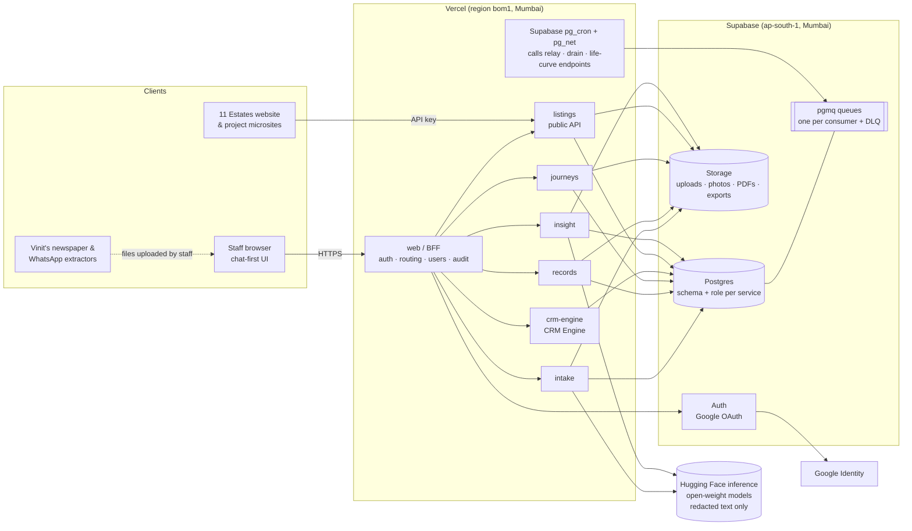
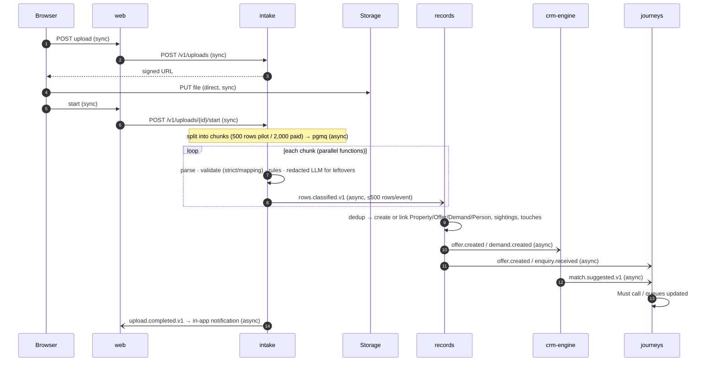
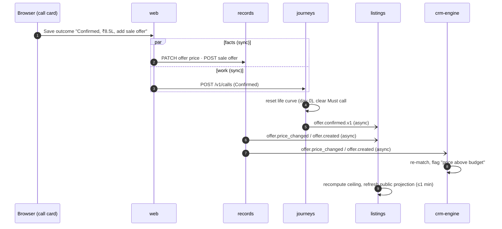
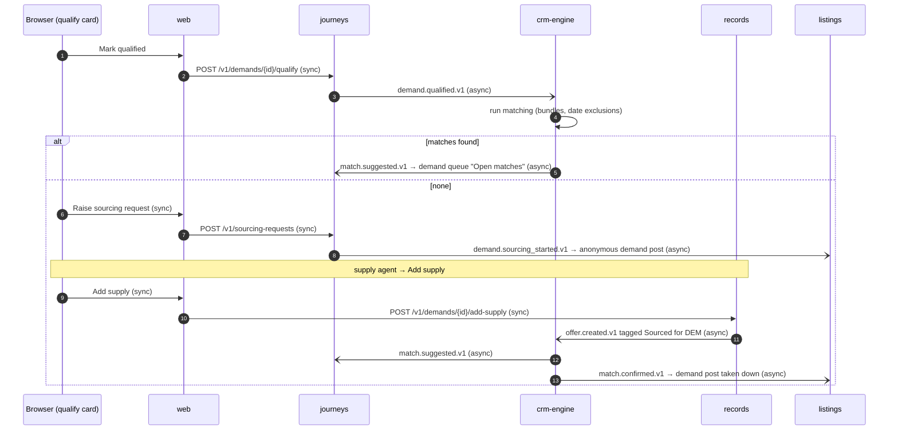
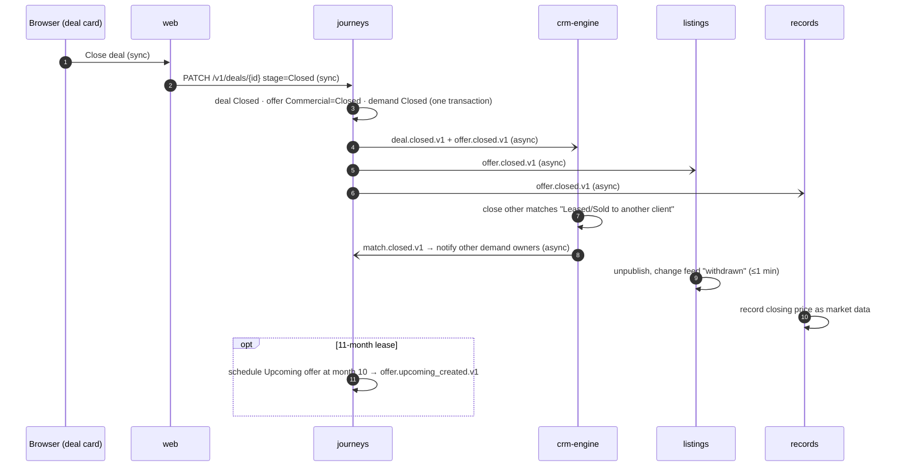
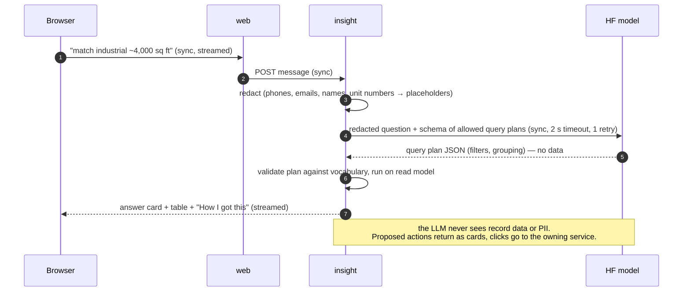

# 03 — High-Level Design (HLD)

| | |
|---|---|
| Project | 11 Estates CRM (estateCRM) |
| Version | 0.2 (draft) |
| Date | 2026-09-24 |
| Based on | BRD v0.6 (approved), PRD v0.5 (approved) |
| Status | APPROVED 2026-09-24 (frozen; changes via Change Request) |

### Inputs from the product owner (2026-09-24)
| # | Input | Effect on this design |
|---|---|---|
| H-1 | **Host Phase 1 all-in on the Vercel ecosystem; move to AWS later.** | Vercel (Mumbai region) for web and services; Supabase (Mumbai) for Postgres, file storage and queues. AWS migration path in ADR-0002. |
| H-2 | **One builder (Sarang + Claude), no other developers.** | Boundaries stay coarse (6 capabilities, the upper end of CLAUDE.md's 3–6). §3.3 gives a merge plan if 6 is too many to run. The final count is your call at approval. |
| H-3 | **AI: hybrid, no personal data to third-party AI.** On Vercel no model can be self-hosted, so the design is **rules first + redaction + Hugging Face-hosted open-weight model on redacted text only** (ADR-0004). | |
| H-4 | **Balanced budget.** CLAUDE.md defaults kept (1,000 rps, 99.9%); infrastructure shared sensibly (one Postgres, a schema and a DB role per service). | ADR-0006 |
| H-5 | **All six services** (answer to Q-2). The matching service is named **CRM Engine** (`crm-engine`). | §2, §3 |
| H-6 | **AI uses Hugging Face open-weight inference models.** Chat answers are scoped to the CRM's own data only. | ADR-0004; CR-004 clarifies BRD A-10 |
| H-7 | **Free plans everywhere for now** (Vercel Hobby, Supabase Free, Hugging Face free credits). There's a paid-plan gate before real data or production use. | CR-005, ADR-0008, §10.2 |

---

## 1. Business capabilities (from the PRD)

| # | Capability | What it covers (PRD refs) |
|---|---|---|
| BC-1 | **Intake** | File upload, strict / mapping modes, templates, validation, extraction and classification, raw rows, row errors, classification review (US-01…03, US-10, D-15) |
| BC-2 | **Records** (system of record) | Property, Project, Offer, Demand, Person, Enquiry, Touch, sightings, dedup and merges, desks (BIZ/CAP/EQP/WCH), market data, photos, the controlled vocabulary and micromarkets (US-04…09, US-13, US-17, US-36, US-37) |
| BC-3 | **Journeys** (work management) | Call queues and outcomes, capacity, life curve engine, commercial status, sourcing requests, proposals, site visits, deals, exits, handoffs and notifications (US-11, US-12, US-16, US-18…27) |
| BC-4 | **Matching (CRM Engine)** | Many-to-many matching, bundles, date-aware exclusions, flags, feedback, weights (US-28, US-29) |
| BC-5 | **Publishing** | Publication ceiling and level, privacy scan, RERA, public projection, Listings API, change feed, anonymous demand posts (US-15, US-33) |
| BC-6 | **Insight** | Chat assistant, dashboards, exports (US-30…32) |
| — | Edge (not a business capability) | Web app / BFF: chat-first UI, Google sign-in, routing, users and roles, audit log sink |

---

## 2. Service catalog

Owner for every service: **Sarang Bondre (with Claude)**. Placeholders are kept per service so a future developer can take one over.

### S1 `intake`: Intake
- **Responsibility:** Turn uploaded files and typed free text into validated, classified candidate rows, in the standard vocabulary.
- **Owns:** uploads, upload_chunks, templates, raw_rows, row_errors, classification results, classification review items, the legacy-term translation table (a copy of the vocabulary release).
- **APIs:**
  - `POST /v1/uploads` (returns a signed storage URL)
  - `GET /v1/uploads`, `GET /v1/uploads/{id}`
  - `PUT /v1/uploads/{id}/mapping`, `POST /v1/uploads/{id}/start`
  - `GET /v1/uploads/{id}/rejected-rows`
  - `GET/POST/PUT /v1/templates`
  - `GET /v1/review-items`, `POST /v1/review-items/{id}/resolve`
  - `POST /v1/parse` (free text → suggested classification, for quick add)
- **Publishes:** `upload.started.v1`, `rows.classified.v1` (batched, ≤ 500 rows per event), `upload.completed.v1`, `upload.failed.v1`, `review_item.resolved.v1`.
- **Consumes:** `vocabulary.released.v1` (records).
- **Depends on:** Supabase Storage, Hugging Face inference (redacted text only).

### S2 `records`: Records (inventory and people)
- **Responsibility:** Be the single source of truth for what exists (properties, projects, offers, demands, people and the other scopes) and for which records are the same.
- **Owns:**
  - property, project, offer (facts, prices, deal tags, Record axis), demand (facts, Record axis);
  - person (party_type, roles, flags), enquiry, touch, sighting links, second sources;
  - merges and their undo log;
  - business, capital, equipment and watchlist items;
  - market data points, photos (metadata; files in Storage);
  - **vocabulary releases**, micromarket hierarchy.
- **APIs:**
  - `GET/POST/PATCH /v1/offers`, `/v1/properties`, `/v1/projects`, `/v1/demands`, `/v1/people`
  - `POST /v1/quick-add` (phone lookup, then create or add a touch)
  - `POST /v1/demands/{id}/add-supply`
  - `POST /v1/projects/{id}/price-sheets`
  - `GET /v1/merge-candidates`, `POST /v1/merges`, `POST /v1/merges/{id}/undo`
  - `GET /v1/desks/{desk}`, `PATCH /v1/desk-items/{id}`
  - `GET /v1/vocabulary`, `GET /v1/micromarkets`
  - `POST /v1/photos` (signed URL)
- **Publishes:**
  - `offer.created.v1`, `offer.updated.v1`, `offer.price_changed.v1`, `offer.record_stage_changed.v1`
  - `demand.created.v1`, `demand.updated.v1`, `demand.touch_added.v1`
  - `enquiry.received.v1`, `records.merged.v1`, `records.merge_undone.v1`
  - `person.flagged.v1`, `watchlist_item.created.v1`, `vocabulary.released.v1`, `photo.added.v1`
- **Consumes:** `rows.classified.v1` (intake), `offer.closed.v1` / `offer.retired.v1` (journeys, to record market data).
- **Depends on:** Supabase Postgres and Storage.

### S3 `journeys`: Journeys (work management)
- **Responsibility:** Tell each team what to do next and move every offer and demand through its stages to Closed or an exit.
- **Owns:**
  - work queues and call attempts, daily capacities;
  - **life curve** (last confirmed, stage);
  - **Commercial axis** for offers and demands, exits;
  - sourcing requests, proposals (PDF, share links), site visits, deals, lease-renewal schedule;
  - in-app notifications.
- **APIs:**
  - `GET /v1/queues/me`, `PUT /v1/capacities/{userId}`
  - `POST /v1/calls` (outcome)
  - `POST /v1/demands/{id}/qualify`, `POST /v1/demands/{id}/exit`
  - `POST/GET /v1/sourcing-requests`, `POST /v1/proposals`, `POST /v1/proposals/{id}/pdf`, `POST /v1/proposals/{id}/share-link`
  - `GET /p/{token}` (proposal share page)
  - `POST /v1/site-visits`, `POST/PATCH /v1/deals`, `POST /v1/offers/{id}/retire`
  - `GET /v1/notifications`
- **Publishes:**
  - `offer.confirmed.v1` / `demand.confirmed.v1` (life curve reset), `lifecycle.stage_changed.v1`
  - `demand.qualified.v1`, `demand.exited.v1`, `demand.sourcing_started.v1`
  - `sourcing_request.created.v1`, `proposal.sent.v1`, `site_visit.completed.v1`
  - `deal.opened.v1`, `deal.closed.v1`, `deal.cancelled.v1`
  - `offer.closed.v1`, `offer.retired.v1`, `offer.upcoming_created.v1`
- **Consumes:**
  - `offer.created.v1`, `demand.created.v1`, `enquiry.received.v1`, `offer.record_stage_changed.v1` (records)
  - `match.suggested.v1`, `match.confirmed.v1` (crm-engine)
  - `demand.touch_added.v1`, `person.flagged.v1`, `watchlist_item.created.v1`
- **Depends on:** Supabase Postgres and Storage (PDFs).

### S4 `crm-engine`: CRM Engine (the brain)
- **Responsibility:** Continuously pair demand with supply, many to many, and rank the pairs. This is the core engine the rest of the CRM runs on.
- **Owns:** a matchable projection of offers and demands (only the fields matching needs: no names or phones), matches, bundles, exclusions, feedback, weights.
- **APIs:** `GET /v1/demands/{id}/matches`, `GET /v1/offers/{id}/matches`, `POST /v1/matches/{id}/confirm`, `POST /v1/matches/{id}/reject`, `POST /v1/bundles`, `GET/PUT /v1/weights`.
- **Publishes:** `match.suggested.v1`, `match.confirmed.v1`, `match.rejected.v1`, `match.closed.v1`, `match.flagged.v1` (price above budget, reconfirm).
- **Consumes:** `offer.created/updated/price_changed.v1`, `demand.created/updated.v1`, `lifecycle.stage_changed.v1`, `demand.qualified.v1`, `demand.exited.v1`, `offer.closed.v1`, `offer.retired.v1`, `records.merged.v1`, `records.merge_undone.v1`.

### S5 `listings`: Publishing and Listings API
- **Responsibility:** Decide what the market may see and serve it to the website and microsites.
- **Owns:** the **Publication axis** (level, ceiling inputs), privacy scan results, the sanitised **public projection** of offers, projects and anonymous demand posts, the change feed, website API keys.
- **APIs:**
  - internal: `GET /v1/offers/{id}/publication` (ceiling + reasons), `PUT /v1/offers/{id}/publication`
  - public (API key): `GET /v1/listings`, `GET /v1/listings/{publicId}`, `GET /v1/projects`, `GET /v1/demand-posts`, `GET /v1/changes?since=`
- **Publishes:** `publication.changed.v1`.
- **Consumes:** `offer.created/updated/price_changed/record_stage_changed.v1`, `photo.added.v1`, `lifecycle.stage_changed.v1` (auto-downgrade), `offer.closed.v1`, `offer.retired.v1`, `demand.sourcing_started.v1`, `match.confirmed.v1` (take down demand post), `demand.exited.v1`.

### S6 `insight`: Insight (chat, dashboards, exports)
- **Responsibility:** Answer questions about the business from a read model: chat, dashboards and Excel exports.
- **Owns:** an analytics read model (denormalised, fed by events), chat conversations, the query-plan catalogue, export jobs and files.
- **APIs:** `POST /v1/chat/conversations/{id}/messages` (streamed), `GET /v1/chat/conversations`, `GET /v1/dashboards/{demand|supply|scopes|quality}`, `POST /v1/exports`, `GET /v1/exports/{id}`.
- **Publishes:** `export.completed.v1`.
- **Consumes:** all `*.v1` domain events listed above (read-only projection).
- **Depends on:** Hugging Face inference (redacted text only; ADR-0004).

### Edge `web`: Web app and BFF (not a business service)
- Next.js on Vercel. Chat-first UI, cards and panels.
- Google sign-in (Supabase Auth). JWT validation, role checks, request routing to services (one hop), rate limits.
- **Users and roles** and the **audit log sink**, which consumes `audit.recorded.v1` from every service.
- Holds no business rules. When the chat proposes an action, the click goes straight to the owning service's API.

---

## 3. Boundary justification

### 3.1 Why these six
| Service | Business owner | Rate of change | Scaling profile | Compliance boundary | Verdict |
|---|---|---|---|---|---|
| intake | Data operators, Vinit (extractors) | High: templates, extractor schema, parsing rules | **Bursty batch** (100k-row files, 1M rows/day) | Handles raw PII-laden text | Separate: batch scaling and parser churn must not destabilise the system of record |
| records | Both teams | Medium: new record kinds, vocabulary releases | OLTP, steady | Holds PII | Separate: the only writer of facts; dedup and merges need one owner |
| journeys | Priyanka (demand) + Vinit (supply) processes | High: queue ranking, stages, capacities, proposals | OLTP + nightly life-curve run | Proposal links expose building names | Separate: business process changes weekly and must not touch the data model |
| crm-engine | Both teams (quality measured by M6) | High: weights, bundle rules, tuning | **CPU-heavy recompute** | No PII (projection only) | Separate: compute scaling and tuning cadence differ; PII-free by design |
| listings | Marketing / website | Low–medium | **External traffic** (the 1,000 rps target is mostly here) | **Public-facing**, RERA, zero-PII guarantee (M8) | Separate: the strongest compliance and security boundary |
| insight | Management | Medium: questions, dashboards | LLM latency, heavy reads | Redaction boundary before any LLM call | Separate: read-only, isolates LLM cost and risk |

### 3.2 Rules check (CLAUDE.md §2)
- Split by **capability**, not by table: records owns ~15 record types; there is no "offer service" or "demand service".
- No shared business-logic service. The web app holds no business rules. `libs/` holds infrastructure only (outbox, auth, logging, vocabulary client).
- **Sync depth ≤ 2:** the browser calls web, and web calls one service. Services never call each other synchronously on a user request. One exception: listings and journeys read records' public GET APIs only when rebuilding a projection, never in a request chain.
- **Would any two always change together?**
  - journeys and crm-engine both react to lifecycle events, but weights and rankings change independently. Kept apart; merge option in §3.3.
  - intake and records change together only on vocabulary releases, which are versioned events.

### 3.3 If six is too many to run alone
In order of preference, each merge keeps the code as a separate module and can be split again later:

1. **crm-engine → journeys** (5 services). Lowest cost; both are driven by the same events.
2. **intake → records** (4 services). Loses the batch/OLTP isolation, so large uploads could slow the app.

**Recommendation: start with all six.** On Vercel each service is a separate project with no idle cost, and Claude builds them in parallel against contract mocks. Merge only if running them becomes a burden.

---

## 4. Architecture

**Event flow:**
1. Each service writes events to **its own outbox table** in the same transaction as the state change.
2. A relay copies new outbox rows into **one pgmq queue per subscribed consumer**. The relay is a per-service function, invoked every minute by **Supabase pg_cron + pg_net** (which works on the free plan) and also poked right after the commit.
3. Each consumer drains its queue in a function, dedupes on `event_id`, and after 5 failed attempts moves the message to its **DLQ** (with an alarm).

See ADR-0003.

---

## 5. Critical flows

### 5.1 Upload a 100k-row file → records → matches (async)

### 5.2 Supply call outcome → life curve → publication and matching

### 5.3 Demand qualified → inventory check → matches or sourcing

### 5.4 Deal closed → offer closed → matches released → listing withdrawn (saga)

### 5.5 Chat question (LLM plans, service executes)

---

## 6. Data ownership map

| Data | Owner | Others get it via |
|---|---|---|
| Uploads, raw rows, row errors, templates, classification review | intake | `rows.classified.v1`, `upload.*` events; intake API (web) |
| Property, Project, Offer facts and prices, deal tags, Record axis | records | `offer.*` events; records API |
| Demand facts, touches, Person, party_type, flags | records | `demand.*`, `person.flagged.v1`; records API |
| Enquiry | records | `enquiry.received.v1` |
| Desks (BIZ/CAP/EQP/WCH), market data | records | `watchlist_item.created.v1`; records API |
| Vocabulary, micromarkets | records | `vocabulary.released.v1`; `GET /v1/vocabulary` (cached by consumers) |
| Life curve, Commercial axis, queues, capacities, SRQ, proposals, visits, deals, exits, notifications | journeys | `lifecycle.*`, `deal.*`, `demand.*` journey events; journeys API |
| Matches, bundles, exclusions, feedback, weights | crm-engine | `match.*` events; crm-engine API |
| Publication axis, public projection, API keys | listings | `publication.changed.v1`; Listings API |
| Read model, conversations, exports | insight | insight API only |
| Users, roles, audit log | web (edge) | JWT claims; audit via `audit.recorded.v1` |

Each service has its own **Postgres schema and DB role**. A role can reach only its own schema. There are no cross-schema joins or reads (ADR-0006).

---

## 7. Consistency plan

| Where | Model | Why it's acceptable |
|---|---|---|
| Upload → records → matches → queues | Eventual (seconds to minutes) | Bulk flows; M2 allows 30 min |
| Offer facts → listings projection | Eventual, ≤ 1 min (NFR-10) | The website tolerates a minute |
| Life curve → auto downgrade / unpublish | Eventual, ≤ 5 min (NFR-9) | Daily-scale thresholds |
| Call outcome: facts (records) + work (journeys) | Two independent sync writes from web. If one fails the card shows a partial state and retries it (idempotency keys) | Each write is valid alone; no invariant spans both |
| Journeys-internal (deal + offer/demand Commercial axis) | **Strong**, one transaction | Same owner |

**Sagas and compensations**

| Saga | Steps | Compensation |
|---|---|---|
| Deal close (5.4) | journeys closes → crm-engine closes other matches → listings unpublishes → records adds market data | **Deal cancelled / reopened** (token refunded, loan rejected): journeys emits `deal.cancelled.v1`, offer → Available, demand → Active. crm-engine reopens the closed matches ("reason no longer valid"). listings recomputes the ceiling and may republish. The market data point is marked void. |
| Merge (records) | records merges → `records.merged.v1` → crm-engine re-keys matches, journeys merges queue items, listings merges projection | **Undo merge**: `records.merge_undone.v1`, and every consumer restores its pre-merge state from its own merge log |
| Demand exit | journeys exit → crm-engine releases → listings takes down the demand post | Re-activation (Dormant revisit): `demand.reactivated.v1` and a re-match |
| Sourced supply | records creates the offer (Sourced for) → crm-engine → journeys Must call | Offer found already gone: journeys retire → `offer.retired.v1`, and crm-engine drops the match |

All consumers are idempotent (dedupe on `event_id`) and handle out-of-order delivery by ignoring older `occurred_at` / version numbers per aggregate.

---

## 8. External integrations

| Integration | Provider | Purpose | Auth | Rate limits | Failure fallback |
|---|---|---|---|---|---|
| Sign-in | Google via Supabase Auth | Staff login (D-7) | OAuth 2.0 / OIDC; invited emails only | Google defaults | Sign-in unavailable. Existing sessions (12 h) continue. Status banner. |
| AI inference | Hugging Face: Inference Providers (free credits) in Phase 1a, a dedicated Inference Endpoint once paid. Open-weight models, chosen in Stage 4 (ADR-0004) | Intake: classify leftover free text. Insight: plan chat queries. **Redacted text only** | HF access token in Vercel env (encrypted) | Free-credit and provider limits; our cap: 5 concurrent calls in Phase 1a, 20 later | Intake: rows get needs_review ("model unavailable") and processing continues. Chat: falls back to keyword filters and says so. |
| Image hosts | Various (links in sheets) | Fetch photos | None / public URL | Our cap: 5 concurrent per host, 2 s timeout | Failure listed on the property. Upload never blocked. |
| Website and microsites | 11 Estates (they call us) | Listings API | API key per site, rotated | 50 rps per key (burst 100) | They serve their cache. The change feed lets them catch up. |
| Extractors | Vinit (newspaper, WhatsApp) | Produce standard-schema files | None (files uploaded by staff) | — | Files are rejected row by row. The data-quality dashboard shows it. |
| Transactional email | Supabase Auth (invites) | Staff invites only | Supabase | Supabase limits | Admin copies the invite link manually |

---

## 9. Deployment topology

| Component | Runs on | Shared or isolated | Why |
|---|---|---|---|
| web, intake, records, journeys, crm-engine, listings, insight | **7 separate Vercel projects** from one monorepo, all in region `bom1` (Mumbai), Fluid compute | Isolated deployables | Independent deploys, versions and CI (CLAUDE.md §3.9). No idle cost. |
| Postgres | **1 Supabase project** (Pro, ap-south-1), **7 schemas + 7 roles**, Supavisor pooler (transaction mode) | Shared cluster, isolated schemas | Balanced budget (H-4). Cross-schema access is denied by role grants. Splits later without code change (ADR-0006). |
| Queues | pgmq in the same Supabase Postgres | Shared | Keeps events in India. Transactional with the outbox. |
| Files | Supabase Storage, one bucket per owning service, private, signed URLs | Isolated buckets | Ownership and residency |
| Schedules | **Supabase pg_cron + pg_net** calls each service's relay and drain endpoints every minute and the life-curve endpoint at 02:00 IST. Endpoints are protected by a per-service secret. | Per service (one job per endpoint) | Vercel Hobby allows only daily cron; pg_cron works on every plan |
| Environments | local (Supabase CLI + `vercel dev`), dev, staging, prod: **one Supabase project and Vercel environment each** | Isolated per environment | CLAUDE.md §3.10: the same build is promoted |

**Scaling.** Functions scale horizontally and automatically. CLAUDE.md's "min 2 instances" is met by the platform (always multi-instance, multi-AZ). The large-upload path fans out to ≤ 20 parallel chunk functions.

---

## 10. Hosting

| Item | Phase 1 choice | Later (AWS move, ADR-0002) |
|---|---|---|
| Cloud and region | Vercel `bom1` (Mumbai) + Supabase `ap-south-1` (Mumbai) | AWS `ap-south-1`, DR `ap-south-2` (Hyderabad) |
| Compute | Vercel Functions (Node.js, Fluid compute). Phase 1a (Hobby): short function limits, so chunks are 500 rows. Pro: ≤ 800 s, 2,000-row chunks | ECS Fargate or Lambda |
| Database | Supabase Postgres (managed, Multi-AZ on Pro with PITR add-on), per-service schema + role, Supavisor pooling | RDS/Aurora PostgreSQL. Schemas move as-is (pg_dump per schema). |
| Event bus | Transactional outbox + pgmq (per-consumer queues + DLQs) | Outbox + SNS/SQS or EventBridge (same event contracts) |
| Object storage | Supabase Storage | S3 |
| Auth | Supabase Auth (Google) | Cognito, or keep Supabase Auth |
| AI | Rules + Hugging Face open-weight models on redacted text (Inference Providers free credits → dedicated Inference Endpoint) | The same models self-hosted on GPU in Mumbai; then redaction becomes defence in depth |
| IaC | Terraform with the Vercel and Supabase providers, and SQL migrations per service | Terraform AWS provider |

### 10.1 Deviations from CLAUDE.md caused by the Vercel choice (recorded now, confirmed in Stage 6)
| CLAUDE.md rule | Phase 1 reality | Mitigation |
|---|---|---|
| §3.8 Databases and internal services in **private networks** | Vercel functions reach Supabase and each other over the public internet (TLS). Private networking needs Vercel Secure Compute (Enterprise). | TLS everywhere. Supabase network restrictions and SSL enforcement. Service-to-service JWTs (short-lived, audience-bound). Rotated DB passwords. Closes on the AWS move, or earlier with Secure Compute. |
| §3.8 Secrets **only in a secrets manager** | Vercel encrypted environment variables | Least-scope per project, no secrets in code, secret scanning in CI. Move to AWS Secrets Manager later. |
| §3.6 **Min 2 instances** per service | Serverless has no fixed instances | Platform autoscaling across AZs meets the intent (no single instance) |
| §3.5 **Slow work through a queue** | Met: pgmq + chunked functions | — |

---

### 10.2 Phase 1a: free plans (CR-005, ADR-0008)
| Plan | Limit that matters | How the design copes |
|---|---|---|
| Vercel Hobby | **Personal, non-commercial use only** (Vercel terms); short function durations; daily-only cron | Pilot uses **sample or anonymised data and internal testing only**. The paid gate is passed before real business use. Chunks are 500 rows. Scheduling moves to Supabase pg_cron. |
| Supabase Free | 500 MB database, 1 GB file storage, **no PITR or managed backups**, pauses after ~1 week idle, 2 projects | Pilot volumes are capped (CR-005). Nightly `pg_dump` per schema to a private GitHub Actions artifact or storage. Environments: **local + one free "pilot" project**. A keep-alive ping. |
| Hugging Face free credits | Small monthly credit; shared providers | Rules first. AI only for unresolved rows and chat. Falls back to needs_review and keyword chat when credits run out. |

**Paid-plan gate** (must be passed before real 11 Estates data, real users, or the website going live):
- Vercel Pro and Supabase Pro with PITR in a Mumbai project.
- A dedicated Hugging Face endpoint (or self-hosted model).
- The NFRs in PRD §8 back in force (restore the CR-005 relaxations).

## 11. Open points for approval

| # | Point | Recommendation |
|---|---|---|
| Q-1 | BRD A-10 and AI processing | **Resolved by the product owner: AI is needed, with answers scoped to our data.** CR-004 raised to reword A-10 (personal data processed only in India; redacted text may go to the HF endpoint). |
| Q-2 | Number of services | **Resolved: all six.** The matching service is named CRM Engine. |
| Q-3 / Q-4 | Plans | **Resolved: free everywhere for now.** CR-005 raised for the pilot relaxations and the paid-plan gate (§10.2). |

## 12. ADRs
| ADR | Decision |
|---|---|
| [0001](adr/0001-service-boundaries.md) | Six capability services + edge BFF |
| [0002](adr/0002-hosting-vercel-supabase-mumbai.md) | Phase 1 on Vercel + Supabase (Mumbai); AWS migration path |
| [0003](adr/0003-event-bus-outbox-pgmq.md) | Transactional outbox + pgmq queues as the event bus |
| [0004](adr/0004-ai-rules-first-redaction.md) | AI: rules first, redaction, LLM plans / service executes |
| [0005](adr/0005-bulk-upload-chunked-fanout.md) | Large uploads: direct-to-storage + chunked fan-out |
| [0006](adr/0006-schema-per-service.md) | One Postgres cluster, a schema and role per service |
| [0007](adr/0007-chat-first-bff.md) | Chat-first web app as BFF; actions via owning services |
| [0008](adr/0008-free-tier-pilot.md) | Phase 1a on free plans with a paid-plan gate |
